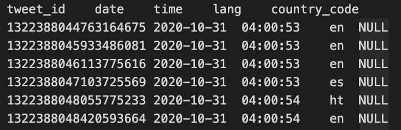
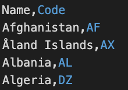
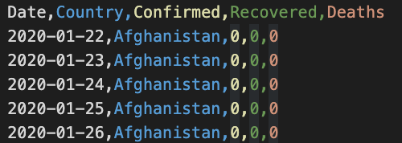
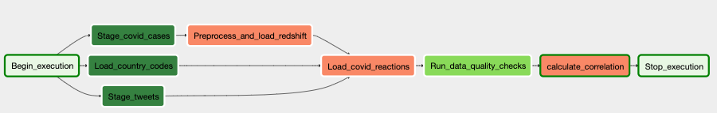
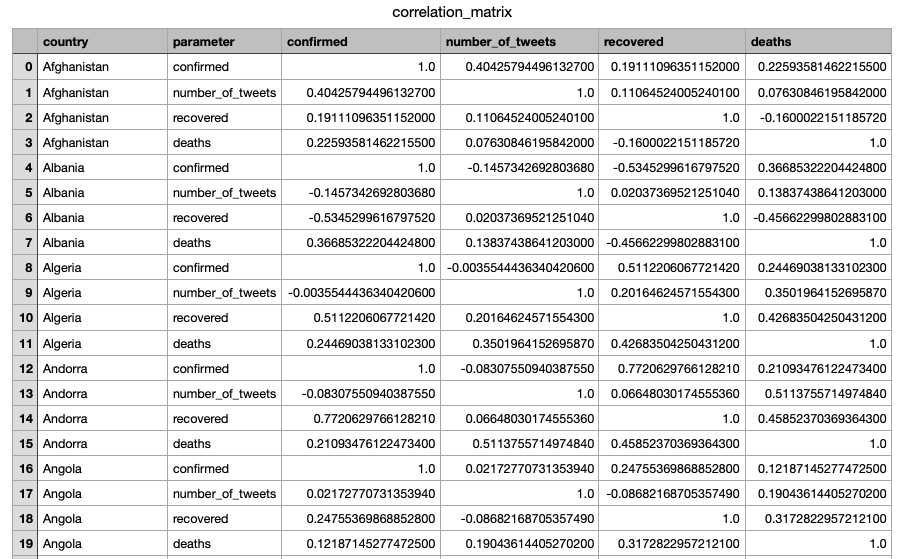

# Capstone project for Data Engineering Nanodegree
This project uses docker, airflow, redshift, S3 and python pandas library.

## Purpose:
 The goal of this project is to calculate the correlation matrix between covid-related twitter activity and the number of covid related statistics (number of cases, deaths and recoveries). 

The example data provided and the DAG calculates the correlation matrix for the month of october 2020 and stores the correlation matrix in S3 as a CSV file. 

## Setup 
- Install and setup apache airflow using docker-compose yaml file provided in the repository: `docker-compose up`
- Create and start a redshift cluster
- Use the table creation SQL statements (in `airflow/capstone_create_tables.sql`) directly in redshift after creating
the redshift cluster.
- In airflow you will need to create three connections: 
    - A Postgres connection for your redshift cluster named: `redshift`
    - An S3 connection named: `S3_conn`
    - An AWS connection with your AWS credentials named: `aws_credentials`
- Change the S3 bucket name in `airflow/dags/capstone_dag.py`
- Download the data in to the local `data` directory using `./download.sh`
- Copy the data to your S3 bucket (replace the name for the S3 bucket):
    ```bash
    export BUCKET_NAME=<your_bucket_name>
    aws s3 cp data/ s3://${BUCKET_NAME}/tweets/ --recursive
    aws s3 cp docs/countries-aggregated.csv s3://${BUCKET_NAME}/cases/
    aws s3 cp docs/country_code.csv s3://${BUCKET_NAME}/countries/
    ```

# About the Data

## Data sources:
- Covid twitter data: https://github.com/thepanacealab/covid19_twitter
- Country code: https://datahub.io/core/country-list
- Covid data per country: https://github.com/datasets/covid-19/blob/master/data/countries-aggregated.csv


## Data Dictionary and Samples


### Covid Twitter data
This is a twitter chatter dataset containing roughly 4 million tweets a day. Since we use the subset of data for october this means well over 100 million rows for this subset of data.

**Files:** `<date>_clean-dataset.tsv.gz`

| Variable     | Variable Name | Type              | Description                     |
|--------------|---------------|-------------------|---------------------------------|
| Tweet ID     | tweet_id      | Numeric           | ID assigned to the tweet        |
| Date         | date          | date (yyyy-mm-dd) | Date of the tweet               |
| Time         | time          | time (hh:mm:ss)   | Time of the tweet in 24h format |
| Language     | lang          | char(2)           | 2-Character Language code       |
| Country code | country_code  | char(2)           | 2-Character Country code        |

____________________
**Data Snippet**



### Country Code
**File:** `country_code.csv`

| Variable     | Variable Name | Type    | Description              |
|--------------|---------------|---------|--------------------------|
| Country Name | Name          | String  | Full Country Name        |
| Country Code | Code          | char(2) | 2-Character Country Code |
__________________________
**Data Snippet**



### CoVID-19 Data
**File:** `countries-aggregated.csv`

| Variable         | Variable Name | Type              | Description                                     |
|------------------|---------------|-------------------|-------------------------------------------------|
| Date             | Date          | date (yyyy-mm-dd) | Date                                            |
| Country Name     | Country       | String            | Full Country Name                               |
| Confirmed Cases  | Confirmed     | Numeric           | Total number of confirmed cases for the country |
| Recovered Cases  | Recovered     | Numeric           | Total number of recovered cases for the country |
| Number of Deaths | Deaths        | Numeric           | Total number of deaths for the country          |
__________________________
**Data Snippet**




# Airflow DAG 
Here's the airflow DAG for this job. This analytics task requires a simple schema with a single fact table `covid_cases` and a single dimension table `countries`. Other dimension tables can be added to expand on the information from twitter if that dataset was made available. 



## Tasks:
This section contains the description of different tasks in the DAG. The schemas for the tables referred subsequently are available in `airflow/capstone_create_tables.sql`.

### Stage Covid Cases:
Inserts data into the `staging_covid_cases` table in redshift based on the data from `countries-aggregated.csv` from S3.

### Load Country codes:
Inserts data into the `countries` table in redshift based on the country code data from `country_code.csv` from S3.

### Stage tweets:
Inserts data into the `staging_tweets` table in redshift based on the gziped tsv data from `{BUCKET_NAME}/tweets/*.tsv.gz` from S3. 

### Preprocess and load redshift:
This operator fetches data from the `staging_covid_cases` and then data is cleaned up by filtering out the data for October (for which we have the twitter data). The aggregate numbers for confirmed cases, recovered cases and deaths and then converted into daily numbers instead by using pandas' `Dataframe.diff()`. This data is then inserted into the `covid_cases` table in redshift 

### Load covid reactions
Data is inserted into the `covid_reactions` fact table in redshift by performing a join between the `covid_cases`, `countries` and `staging_tweets` data. 

### Run data quality checks
Current data quality checks simply check if there are records in the `covid_reactions` and `countries` redshift table.

### calculate correlation
Calculates pearson pairwise correlation between the daily number of tweets from a country and the number of daily cases, deaths and recoveries. This correlation matrix is then stored into S3. 
Here's a snippet of what the correlation matrix looks like. 



# Limitations:
- One of the limitations of this analysis is that a lot of tweets do not include country information. So the correlation matrix should be taken with the grain of salt. 
- Having more data about the users to whom the tweets belonged or the content of the tweets could help us enhance the analysis further. 

# Other scenarios:

## 100x Data size:
In this cases instead of using python with pandas, distributed data processing framework like Apache Spark should be used for correlation matrix calculation.

## Daily Execution:
Templates from airflow can be used to process the daily data and update the correlation matrix accordingly

## Database needs to access by 100+ people:
We could continue using redshift as long as it is proportionally provisioned. But DynamoDB could be a potentially better managed option to use as long as data consistency contraints allow it. 

